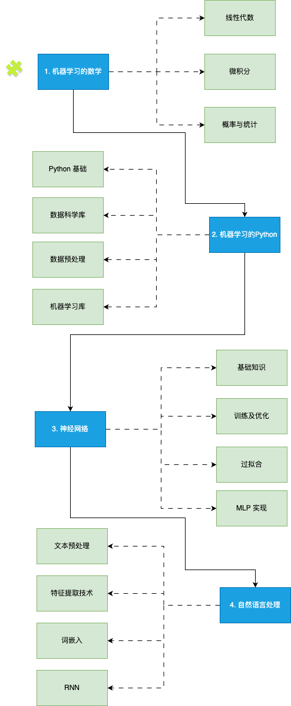
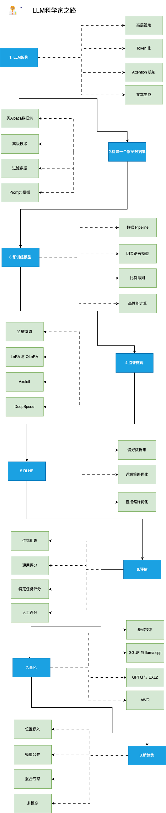
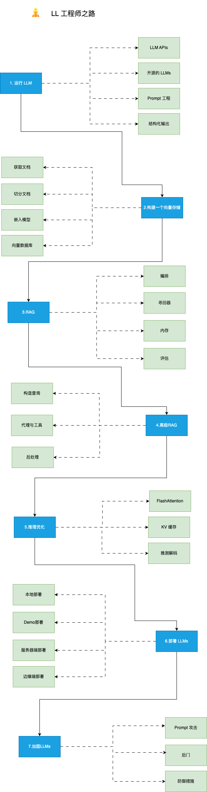

# llm-course-chn

# 许可
```
向mlabonne申请了中文的翻译许可！  
https://github.com/mlabonne/llm-course/issues/57
```

<div align="center">
  <h1>🗣️ 大语言模型课程</h1>
  <p align="center">
    🐦 <a href="https://twitter.com/maximelabonne">在X上关注我</a> • 
    🤗 <a href="https://huggingface.co/mlabonne">Hugging Face</a> • 
    💻 <a href="https://mlabonne.github.io/blog">博客</a> • 
    📙 <a href="https://github.com/PacktPublishing/Hands-On-Graph-Neural-Networks-Using-Python">动手学图神经网络</a> • 
    🗣️ <a href="https://chat.openai.com/g/g-yviLuLqvI-llm-course">交互式GPT</a>
  </p>
</div>
<br/>


大语言模型课程分为三个部分：

1. 🧩 **LLM基础** 涵盖关于数学、Python和神经网络的基础知识。
2. 🧑‍🔬 **LLM科学家** 侧重于使用最新技术构建最佳的LLM。
3. 👷 **LLM工程师** 侧重于创建基于LLM的应用程序并部署它们。

## 📝 笔记本

与大语言模型相关的笔记本和文章列表。

### 工具

| 笔记本 | 描述 | 笔记本 |
|----------|-------------|----------|
| 🧐 [LLM自动评估](https://github.com/mlabonne/llm-autoeval) | 使用RunPod自动评估您的LLM | <a href="https://colab.research.google.com/drive/1Igs3WZuXAIv9X0vwqiE90QlEPys8e8Oa?usp=sharing"></a> |
| 🥱 LazyMergekit | 使用mergekit一键轻松合并模型。 | <a href="https://colab.research.google.com/drive/1obulZ1ROXHjYLn6PPZJwRR6GzgQogxxb?usp=sharing"></a> |
| 🦎 LazyAxolotl | 一键在云上微调模型。 | <a href="https://colab.research.google.com/drive/1TsDKNo2riwVmU55gjuBgB1AXVtRRfRHW?usp=sharing"></a> |
| ⚡ AutoGGUF | 一键将LLM量化为GGUF格式。 | <a href="https://colab.research.google.com/drive/1P646NEg33BZy4BfLDNpTz0V0lwIU3CHu?usp=sharing"></a> |
| 🌳 模型家族树 | 可视化合并模型的家族树。 | <a href="https://colab.research.google.com/drive/1s2eQlolcI1VGgDhqWIANfkfKvcKrMyNr?usp=sharing"></a> |


### 微调

| 笔记本 | 描述 | 文章 | 笔记本 |
|---------------------------------------|-------------------------------------------------------------------------|---------------------------------------------------------------------------------------------|------------------------------------------------------------------------------------------------------------------------------------------------------|
| 在Google Colab中微调Llama 2 | 一步一步指导如何微调您的第一个Llama 2模型。 | [文章](https://mlabonne.github.io/blog/posts/Fine_Tune_Your_Own_Llama_2_Model_in_a_Colab_Notebook.html) | <a href="https://colab.research.google.com/drive/1PEQyJO1-f6j0S_XJ8DV50NkpzasXkrzd?usp=sharing"></a> |
| 使用Axolotl微调LLM | 微调的最新工具的端到端指南。 | [文章](https://mlabonne.github.io/blog/posts/A_Beginners_Guide_to_LLM_Finetuning.html) | <a href="https://colab.research.google.com/drive/1Xu0BrCB7IShwSWKVcfAfhehwjDrDMH5m?usp=sharing"></a> |
| 使用DPO微调Mistral-7b | 通过DPO提升监督微调模型的性能。 | [文章](https://medium.com/towards-data-science/fine-tune-a-mistral-7b-model-with-direct-preference-optimization-708042745aac) | <a href="https://colab.research.google.com/drive/15iFBr1xWgztXvhrj5I9fBv20c7CFOPBE?usp=sharing"></a> |

### Quantization

| Notebook | Description | Article | Notebook |
|---------------------------------------|-------------------------------------------------------------------------|---------------------------------------------------------------------------------------------|------------------------------------------------------------------------------------------------------------------------------------------------------|
| 1. Introduction to Quantization | Large language model optimization using 8-bit quantization. | [Article](https://mlabonne.github.io/blog/posts/Introduction_to_Weight_Quantization.html) | <a href="https://colab.research.google.com/drive/1DPr4mUQ92Cc-xf4GgAaB6dFcFnWIvqYi?usp=sharing"></a> |
| 2. 4-bit Quantization using GPTQ | Quantize your own open-source LLMs to run them on consumer hardware. | [Article](https://mlabonne.github.io/blog/4bit_quantization/) | <a href="https://colab.research.google.com/drive/1lSvVDaRgqQp_mWK_jC9gydz6_-y6Aq4A?usp=sharing"></a> |
| 3. Quantization with GGUF and llama.cpp | Quantize Llama 2 models with llama.cpp and upload GGUF versions to the HF Hub. | [Article](https://mlabonne.github.io/blog/posts/Quantize_Llama_2_models_using_ggml.html) | <a href="https://colab.research.google.com/drive/1pL8k7m04mgE5jo2NrjGi8atB0j_37aDD?usp=sharing"></a> |
| 4. ExLlamaV2: The Fastest Library to Run LLMs | Quantize and run EXL2 models and upload them to the HF Hub. | [Article](https://mlabonne.github.io/blog/posts/ExLlamaV2_The_Fastest_Library_to_Run%C2%A0LLMs.html) | <a href="https://colab.research.google.com/drive/1yrq4XBlxiA0fALtMoT2dwiACVc77PHou?usp=sharing"></a> |


### 量化

| 笔记本 | 描述 | 文章 | 笔记本 |
|---------------------------------------|-------------------------------------------------------------------------|---------------------------------------------------------------------------------------------|------------------------------------------------------------------------------------------------------------------------------------------------------|
| 1. 量化入门 | 使用8位量化优化大型语言模型。 | [文章](https://mlabonne.github.io/blog/posts/Introduction_to_Weight_Quantization.html) | <a href="https://colab.research.google.com/drive/1DPr4mUQ92Cc-xf4GgAaB6dFcFnWIvqYi?usp=sharing"></a> |
| 2. 使用GPTQ进行4位量化 | 将您自己的开源LLM量化，以便在消费硬件上运行。 | [文章](https://mlabonne.github.io/blog/4bit_quantization/) | <a href="https://colab.research.google.com/drive/1lSvVDaRgqQp_mWK_jC9gydz6_-y6Aq4A?usp=sharing"></a> |
| 3. 使用GGUF和llama.cpp量化 | 使用llama.cpp量化Llama 2模型，并将GGUF版本上传到HF Hub。 | [文章](https://mlabonne.github.io/blog/posts/Quantize_Llama_2_models_using_ggml.html) | <a href="https://colab.research.google.com/drive/1pL8k7m04mgE5jo2NrjGi8atB0j_37aDD?usp=sharing"></a> |
| 4. ExLlamaV2：最快的运行LLM库 | 量化并运行EXL2模型，并将它们上传到HF Hub。 | [文章](https://mlabonne.github.io/blog/posts/ExLlamaV2_The_Fastest_Library_to_Run%C2%A0LLMs.html) | <a href="https://colab.research.google.com/drive/1yrq4XBlxiA0fALtMoT2dwiACVc77PHou?usp=sharing"></a> |

### 其他

| 笔记本 | 描述 | 文章 | 笔记本 |
|---------------------------------------|-------------------------------------------------------------------------|---------------------------------------------------------------------------------------------|------------------------------------------------------------------------------------------------------------------------------------------------------|
| 大型语言模型中的解码策略 | 从束搜索到核心抽样的文本生成指南 | [文章](https://mlabonne.github.io/blog/posts/2022-06-07-Decoding_strategies.html) | <a href="https://colab.research.google.com/drive/19CJlOS5lI29g-B3dziNn93Enez1yiHk2?usp=sharing"></a> |
| 可视化GPT-2的损失 | 基于权重扰动的损失3D图。 | [推文](https://twitter.com/maximelabonne/status/1667618081844219904) | <a href="https://colab.research.google.com/drive/1Fu1jikJzFxnSPzR_V2JJyDVWWJNXssaL?usp=sharing"></a> |
| 用知识图谱改善ChatGPT | 用知识图谱增强ChatGPT的回答。 | [文章](https://mlabonne.github.io/blog/posts/Article_Improve_ChatGPT_with_Knowledge_Graphs.html) | <a href="https://colab.research.google.com/drive/1mwhOSw9Y9bgEaIFKT4CLi0n18pXRM4cj?usp=sharing"></a> |
| 使用mergekit合并LLM | 轻松创建您自己的模型，无需GPU！ | [文章](https://towardsdatascience.com/merge-large-language-models-with-mergekit-2118fb392b54) | <a href="https://colab.research.google.com/drive/1_JS7JKJAQozD48-LhYdegcuuZ2ddgXfr?usp=sharing"></a> |


## 🧩 LLM基础



### 1. 机器学习的数学

在掌握机器学习之前，了解驱动这些算法的基本数学概念非常重要。

- **线性代数**：这对于理解许多算法尤其是在深度学习中使用的算法至关重要。关键概念包括向量、矩阵、行列式、特征值和特征向量、向量空间和线性变换。
- **微积分**：许多机器学习算法涉及连续函数的优化，这需要理解导数、积分、极限和级数。多变量微积分和梯度概念也很重要。
- **概率与统计**：这些对于理解模型如何从数据中学习并做出预测至关重要。关键概念包括概率论、随机变量、概率分布、期望、方差、协方差、相关性、假设检验、置信区间、最大似然估计和贝叶斯推断。

📚 资源：

- [3Blue1Brown - 线性代数的精髓](https://www.youtube.com/watch?v=fNk_zzaMoSs&list=PLZHQObOWTQDPD3MizzM2xVFitgF8hE_ab)：一系列视频，提供了这些概念的几何直观感受。
- [StatQuest with Josh Starmer - 统计学基础](https://www.youtube.com/watch?v=qBigTkBLU6g&list=PLblh5JKOoLUK0FLuzwntyYI10UQFUhsY9)：为许多统计概念提供简单明了的解释。
- [AP Statistics Intuition by Ms Aerin](https://automata88.medium.com/list/cacc224d5e7d)：Medium文章列表，提供了每个概率分布背后的直觉理解。
- [沉浸式线性代数](https://immersivemath.com/ila/learnmore.html)：线性代数的另一种视觉解读。
- [Khan Academy - 线性代数](https://www.khanacademy.org/math/linear-algebra)：非常适合初学者，以非常直观的方式解释概念。
- [Khan Academy - 微积分](https://www.khanacademy.org/math/calculus-1)：一个涵盖所有基础微积分概念的互动课程。
- [Khan Academy - 概率与统计](https://www.khanacademy.org/math/statistics-probability)：以易于理解的格式提供材料。

---

### 2. 机器学习的Python

Python是一种功能强大且灵活的编程语言，特别适用于机器学习，这得益于其可读性、一致性和健壮的数据科学库生态系统。

- **Python基础**：Python编程需要理解基本语法、数据类型、错误处理和面向对象编程。
- **数据科学库**：熟悉NumPy进行数值操作，用Pandas进行数据处理和分析，用Matplotlib和Seaborn做数据可视化。
- **数据预处理**：涉及特征缩放和规范化、处理缺失数据、异常检测、类别数据编码，以及将数据分割为训练、验证和测试集。
- **机器学习库**：熟练使用Scikit-learn，这是一个提供广泛的监督和无监督学习算法的python库，至关重要。理解如何实现线性回归、逻辑回归、决策树、随机森林、最近邻（K-NN）和K均值聚类等算法很重要。降维技术如PCA和t-SNE对于可视化高维数据也很有帮助。

📚 资源：

- [Real Python](https://realpython.com/)：一个全面的资源，提供针对Python初学者和高级概念的文章和教程。
- [freeCodeCamp - 学习Python](https://www.youtube.com/watch?v=rfscVS0vtbw)：提供Python所有核心概念全面介绍的长视频。
- [Python数据科学手册](https://jakevdp.github.io/PythonDataScienceHandbook/)：一个很好的学习pandas、NumPy、Matplotlib和Seaborn的免费数字书。
- [freeCodeCamp - 机器学习入门](https://youtu.be/i_LwzRVP7bg)：为初学者提供不同机器学习算法的实用介绍。
- [Udacity - 机器学习入门](https://www.udacity.com/course/intro-to-machine-learning--ud120)：一个免费课程，涵盖了PCA和其他几个机器学习概


### 3. 神经网络

神经网络是许多机器学习模型的基础部分，特别是在深度学习领域。为了有效地利用它们，对它们的设计和机制有一个全面的理解是必要的。

- **基础知识**：这包括了解神经网络的结构，如层、权重、偏差和激活函数（sigmoid、tanh、ReLU等）。
- **训练和优化**：熟悉反向传播和不同类型的损失函数，如均方误差（MSE）和交叉熵。理解各种优化算法，如梯度下降、随机梯度下降、RMSprop和Adam。
- **过拟合**：理解过拟合的概念（模型在训练数据上表现良好但在未见数据上表现不佳）并学习各种正则化技术（dropout、L1/L2正则化、提前停止、数据增强）来防止它。
- **实现多层感知机（MLP）**：使用PyTorch构建一个MLP，也称为全连接网络。

📚 资源：

- [3Blue1Brown - 神经网络是什么？](https://www.youtube.com/watch?v=aircAruvnKk)：这个视频直观地解释了神经网络及其内部工作原理。
- [freeCodeCamp - 深度学习速成课](https://www.youtube.com/watch?v=VyWAvY2CF9c)：这个视频高效地介绍了深度学习中所有最重要的概念。
- [Fast.ai - 实用深度学习](https://course.fast.ai/)：为有编程经验想学习深度学习的人设计的免费课程。
- [Patrick Loeber - PyTorch教程](https://www.youtube.com/playlist?list=PLqnslRFeH2UrcDBWF5mfPGpqQDSta6VK4)：一系列视频，让完全的初学者学习PyTorch。

---

### 4. 自然语言处理（NLP）

NLP是人工智能的一个迷人分支，它桥接了人类语言与机器理解之间的差距。从简单的文本处理到理解语言细微差别，NLP在许多应用中发挥着关键作用，如翻译、情感分析、聊天机器人等等。

- **文本预处理**：学习各种文本预处理步骤，如分词（将文本分割成单词或句子）、词干提取（将词汇还原到其根形式）、词形还原（类似于词干提取但考虑上下文）、停用词移除等。
- **特征提取技术**：熟悉将文本数据转换为机器学习算法能理解的格式的技术。关键方法包括词袋（BoW）、词频-逆文档频率（TF-IDF）和n-gram。
- **词嵌入**：词嵌入是一种词表示方式，允许意义相近的词有相似的表示。关键方法包括Word2Vec、GloVe和FastText。
- **循环神经网络（RNNs）**：理解RNN的工作原理，RNN是一种设计用来处理序列数据的神经网络。探索LSTM和GRU，这两种RNN变体能够学习长期依赖。

📚 资源：

- [RealPython - 使用spaCy进行Python自然语言处理](https://realpython.com/natural-language-processing-spacy-python/)：关于Python中spaCy库进行NLP任务的详尽指南。
- [Kaggle - NLP指南](https://www.kaggle.com/learn-guide/natural-language-processing)：一些笔记本和资源，用于Python中NLP的实践解释。
- [Jay Alammar - Word2Vec图解](https://jalammar.github.io/illustrated-word2vec/)：理解著名的Word2Vec架构的好参考。
- [Jake Tae - 从零开始的PyTorch RNN](https://jaketae.github.io/study/pytorch-rnn/)：在PyTorch中实践和简单实现RNN、LSTM和GRU模型。
- [colah的博客 - 理解LSTM网络](https://colah.github.io/posts/2015-08-Understanding-LSTMs/)：关于LSTM网络的更理论化文章。

## 🧑‍🔬 LLM科学家

本课程部分侧重于学习如何使用最新技术构建最佳的LLM。



### 1. LLM架构

虽然不需要深入了解Transformer架构，但重要的是要很好地理解它的输入（令牌）和输出（logits）。原始注意力机制是另一个需要掌握的关键组成部分，因为后续会介绍它的改进版本。

* **高层视图**：回顾编码器-解码器Transformer架构，更具体地说是在每个现代LLM中使用的仅解码器GPT架构。
* **令牌化**：理解如何将原始文本数据转换成模型可以理解的格式，这涉及将文本分割成令牌（通常是单词或子词）。
* **注意力机制**：掌握注意力机制背后的理论，包括自注意力和缩放点积注意力，这使得模型在产生输出时能够关注输入的不同部分。
* **文本生成**：了解模型可以生成输出序列的不同方式。常见策略包括贪婪解码、束搜索、Top-k采样和核采样。

📚 **参考资料**：
- [插图式Transformer](https://jalammar.github.io/illustrated-transformer/) 作者Jay Alammar：对Transformer模型的直观和视觉解释。
- [插图式GPT-2](https://jalammar.github.io/illustrated-gpt2/) 作者Jay Alammar：比前一篇文章更重要，它专注于GPT架构，与Llama非常相似。
- [LLM可视化](https://bbycroft.net/llm) 作者Brendan Bycroft：令人难以置信的LLM内部3D可视化。
* [nanoGPT](https://www.youtube.com/watch?v=kCc8FmEb1nY) 作者Andrej Karpathy：一个2小时长的YouTube视频，从头开始重新实现GPT（面向程序员）。
* [注意力？注意力！](https://lilianweng.github.io/posts/2018-06-24-attention/) 作者Lilian Weng：以更正式的方式介绍注意力的需求。
* [LLM中的解码策略](https://mlabonne.github.io/blog/posts/2023-06-07-Decoding_strategies.html)：提供代码和直观介绍不同文本生成解码策略。

---
### 2. 构建指令数据集

虽然从维基百科和其他网站找到原始数据很容易，但在野外收集指令和答案的配对却很难。就像在传统机器学习中一样，数据集的质量将直接影响模型的质量，这就是为什么它可能是微调过程中最重要的组件。

* **[Alpaca](https://crfm.stanford.edu/2023/03/13/alpaca.html)-样数据集**：使用OpenAI API（GPT）从头生成合成数据。您可以指定种子和系统提示来创建多样化的数据集。
* **高级技术**：了解如何使用[Evol-Instruct](https://arxiv.org/abs/2304.12244)改进现有数据集，如何像[Orca](https://arxiv.org/abs/2306.02707)和[phi-1](https://arxiv.org/abs/2306.11644)论文中那样生成高质量合成数据。
* **过滤数据**：传统技术包括使用正则表达式、删除近似重复项、专注于含有大量令牌的答案等。
* **提示模板**：没有真正的标准格式来格式化指令和答案，这就是为什么了解不同的聊天模板很重要，例如[ChatML](https://learn.microsoft.com/en-us/azure/ai-services/openai/how-to/chatgpt?tabs=python&pivots=programming-language-chat-ml)、[Alpaca](https://crfm.stanford.edu/2023/03/13/alpaca.html)等。

📚 **参考资料**：
* [为指令调优准备数据集](https://wandb.ai/capecape/alpaca_ft/reports/How-to-Fine-Tune-an-LLM-Part-1-Preparing-a-Dataset-for-Instruction-Tuning--Vmlldzo1NTcxNzE2) 作者Thomas Capelle：探索Alpaca和Alpaca-GPT4数据集及其格式化方式。
* [生成葡萄牙语临床指令数据集](https://medium.com/mlearning-ai/generating-a-clinical-instruction-dataset-in-portuguese-with-langchain-and-gpt-4-6ee9abfa41ae) 作者Solano Todeschini：教程，介绍如何使用GPT-4创建合成指令数据集。
* [使用GPT 3.5进行新闻分类](https://medium.com/@kshitiz.sahay26/how-i-created-an-instruction-dataset-using-gpt-3-5-to-fine-tune-llama-2-for-news-classification-ed02fe41c81f) 作者Kshitiz Sahay：使用GPT 3.5创建指令数据集，以微调Llama 2进行新闻分类。
* [微调LLM的数据集创建](https://colab.research.google.com/drive/1GH8PW9-zAe4cXEZyOIE-T9uHXblIldAg?usp=sharing)：包含一些过滤数据集并上传结果的技术的笔记本。
* [聊天模板](https://huggingface.co/blog/chat-templates) 作者Matthew Carrigan：Hugging Face关于提示模板的页面。

---
### 3. 预训练模型

预训练是一个非常漫长且成本高昂的过程，这就是为什么这不是本课程的重点。了解预训练期间发生的事情的某种程度是好的，但不需要亲手实践。

* **数据管道**：预训练需要巨大的数据集（例如，[Llama 2](https://arxiv.org/abs/2307.09288)是在2万亿令牌上训练的）需要过滤、令牌化，并与预定义的词汇表协同。
* **因果语言建模**：了解因果和掩码语言建模的区别，以及在这种情况下使用的损失函数。为了高效预训练，进一步了解[Megatron-LM](https://github.com/NVIDIA/Megatron-LM)或[gpt-neox](https://github.com/EleutherAI/gpt-neox)。
* **规模定律**：[规模定律](https://arxiv.org/pdf/2001.08361.pdf)根据模型大小、数据集大小和用于训练的计算量描述了预期的模型性能。
* **高性能计算**：这里不在讨论范围内，但如果你计划从头开始创建自己的LLM（硬件、分布式工作负载等），更多关于HPC的知识是基础。

📚 **参考资料**：
* [LLMDataHub](https://github.com/Zjh-819/LLMDataHub) 作者Junhao Zhao：为预训练、微调和RLHF精心策划的数据集列表。
* [从头开始预训练因果语言模型](https://huggingface.co/learn/nlp-course/chapter7/6?fw=pt) 作者Hugging Face：使用transformers库从头开始预训练GPT-2模型。
* [TinyLlama](https://github.com/jzhang38/TinyLlama) 作者Zhang等：查看此项目以深入了解如何从头开始训练Llama模型。
* [因果语言建模](https://huggingface.co/docs/transformers/tasks/language_modeling) 作者Hugging Face：解释因果和掩码语言建模的区别，以及如何快速微调DistilGPT-2模型。
* [Chinchilla的狂野含义](https://www.lesswrong.com/posts/6Fpvch8RR29qLEWNH/chinchilla-s-wild-implications) 作者nostalgebraist：讨论规模定律并解释它们对LLM通常意味着什么。
* [BLOOM](https://bigscience.notion.site/BLOOM-BigScience-176B-Model-ad073ca07cdf479398d5f95d88e218c4) 作者BigScience：Notion页面描述了如何构建BLOOM模型，包含大量关于工程部分和遇到的问题的有用信息。
* [OPT-175日志](https://github.com/facebookresearch/metaseq/blob/main/projects/OPT/chronicles/OPT175B_Logbook.pdf) 作者Meta：研究日志显示了什么出了问题，什么做得对。如果你计划预训练一个非常大的语言模型（在这种情况下，175B参数），这非常有用。
* [LLM 360](https://www.llm360.ai/)：一个开源LLM的框架，包含训练和数据准备代码、数据、指标和模型。

---
### 4. 监督式微调

预训练模型仅在下一个令牌预测任务上进行训练，这就是为什么它们不是有用的助手。SFT允许您调整它们以响应指令。此外，它允许您在任何数据上（私有的，GPT-4未见过的等）微调模型，并在不必支付OpenAI等API费用的情况下使用它。

* **全面微调**：全面微调指的是训练模型中的所有参数。这不是一种高效的技术，但它产生略微更好的结果。
* [**LoRA**](https://arxiv.org/abs/2106.09685)：一种基于低秩适配器的参数高效技术（PEFT）。我们不是训练所有参数，而只训练这些适配器。
* [**QLoRA**](https://arxiv.org/abs/2305.14314)：另一种基于LoRA的PEFT，它还将模型的权重量化为4比特，并引入分页优化器来管理内存峰值。结合[Unsloth](https://github.com/unslothai/unsloth)在免费的Colab笔记本上高效运行。
* **[Axolotl](https://github.com/OpenAccess-AI-Collective/axolotl)**：一个用户友好且功能强大的微调工具，用于许多最先进的开源模型。
* [**DeepSpeed**](https://www.deepspeed.ai/)：高效的预训练和微调LLM，适用于多GPU和多节点设置（在Axolotl中实现）。

📚 **参考资料**：
* [新手LLM训练指南](https://rentry.org/llm-training) 作者Alpin：微调LLM时考虑的主要概念和参数的概览。
* [LoRA洞见](https://lightning.ai/pages/community/lora-insights/) 作者Sebastian Raschka：关于LoRA的实践见解以及如何选择最佳参数。
* [微调你自己的Llama 2模型](https://mlabonne.github.io/blog/posts/Fine_Tune_Your_Own_Llama_2_Model_in_a_Colab_Notebook.html)：手把手教程，介绍如何使用Hugging Face库微调Llama 2模型。
* [为因果LLM填充训练示例](https://towardsdatascience.com/padding-large-language-models-examples-with-llama-2-199fb10df8ff) 作者Benjamin Marie：因果LLM填充训练示例的最佳实践
* [LLM微调入门指南](https://mlabonne.github.io/blog/posts/A_Beginners_Guide_to_LLM_Finetuning.html)：教程，介绍如何使用Axolotl微调CodeLlama模型。

---

### 5. 人类反馈的强化学习

在监督式微调之后，RLHF是用来将LLM的答案与人类期望对齐的一步。其思想是从人类（或人工）反馈中学习偏好，这可以用来减少偏见、审查模型或使其以更有用的方式行动。它比SFT更复杂，通常被视为可选的。

* **偏好数据集**：这些数据集通常包含有某种排名的几个答案，这使得它们比指令数据集更难产出。
* [**近端策略优化**](https://arxiv.org/abs/1707.06347)：这种算法利用一个奖励模型，预测给定文本是否由人类高度评价。然后，这个预测被用来优化SFT模型，基于KL散度的惩罚。
* **[直接偏好优化](https://arxiv.org/abs/2305.18290)**：DPO通过将问题重构为一个分类问题来简化过程。它使用一个参考模型而不是奖励模型（无需训练），只需要一个超参数，使其更稳定和高效。

📚 **参考资料**：
* [使用RLHF训练LLM的介绍](https://wandb.ai/ayush-thakur/Intro-RLAIF/reports/An-Introduction-to-Training-LLMs-Using-Reinforcement-Learning-From-Human-Feedback-RLHF---VmlldzozMzYyNjcy) 作者Ayush Thakur：解释为什么使用RLHF减少偏见和提高LLM的性能是可取的。
* [RLHF插图](https://huggingface.co/blog/rlhf) 作者Hugging Face：使用奖励模型训练和强化学习微调的RLHF介绍。
* [StackLLaMA](https://huggingface.co/blog/stackllama) 作者Hugging Face：使用transformers库高效对齐LLaMA模型与RLHF的教程。
* [LLM训练：RLHF及其替代方案](https://substack.com/profile/27393275-sebastian-raschka-phd) 作者Sebastian Rashcka：RLHF过程及其替代方案如RLAIF的概览。
* [使用DPO微调Mistral-7b](https://huggingface.co/blog/dpo-trl)：使用DPO微调Mistral-7b模型并复制[NeuralHermes-2.5](https://huggingface.co/mlabonne/NeuralHermes-2.5-Mistral-7B)的教程。

---
### 6. 评估

评估LLM是流程中一个被低估的部分，它既耗时又相对可靠。您的下游任务应该决定您想要评估什么，但总是记得好特德法则：“当一个度量成为目标时，它就不再是一个好的度量。”

* **传统指标**：像困惑度和BLEU分数这样的指标因为在大多数情境下都存在缺陷而不再流行。了解它们并知道它们何时可以应用仍然很重要。
* **通用基准**：基于[语言模型评估工具包](https://github.com/EleutherAI/lm-evaluation-harness)，[Open LLM排行榜](https://huggingface.co/spaces/HuggingFaceH4/open_llm_leaderboard)是通用LLM（如ChatGPT）的主要基准。还有其他流行的基准，如[BigBench](https://github.com/google/BIG-bench)、[MT-Bench](https://arxiv.org/abs/2306.05685)等。
* **任务特定基准**：如摘要、翻译和问答任务有专门的基准、指标，甚至子领域（医学、金融等），例如生物医学问答的[PubMedQA](https://pubmedqa.github.io/)。
* **人类评估**：最可靠的评估是用户的接受率或人类进行的比较。如果您想知道模型是否表现良好，最简单但最确实的方式是自己使用它。

📚 **参考资料**：
* [固定长度模型的困惑度](https://huggingface.co/docs/transformers/perplexity) 作者Hugging Face：使用transformers库实现困惑度的概览及代码。
* [自担风险的BLEU](https://towardsdatascience.com/evaluating-text-output-in-nlp-bleu-at-your-own-risk-e8609665a213) 作者Rachael Tatman：BLEU分数及其众多问题的概览及示例。
* [LLM评估综述](https://arxiv.org/abs/2307.03109) 作者Chang等：关于评估什么、在哪里评估以及如何评估的综合论文。
* [聊天机器人竞技场排行榜](https://huggingface.co/spaces/lmsys/chatbot-arena-leaderboard) 作者lmsys：基于人类比较的通用用途LLM的Elo评分。

---
### 7. 量化

量化是使用较低精度转换模型的权重（和激活）的过程。例如，使用16位存储的权重可以转换为4位表示。这项技术变得越来越重要，以减少与LLM相关的计算和内存成本。

* **基础技术**：了解不同精度级别（FP32、FP16、INT8等）以及如何使用absmax和零点技术进行简单量化。
* **GGUF和llama.cpp**：最初设计用于在CPU上运行，[llama.cpp](https://github.com/ggerganov/llama.cpp)和GGUF格式已成为在消费级硬件上运行LLM的最受欢迎的工具。
* **GPTQ和EXL2**：[GPTQ](https://arxiv.org/abs/2210.17323)特别是[EXL2](https://github.com/turboderp/exllamav2)格式提供了令人难以置信的速度，但只能在GPU上运行。模型量化也需要很长时间。
* **AWQ**：这种新格式比GPTQ更精确（困惑度更低），但使用的VRAM更多，不一定更快。

📚 **参考资料**：
* [量化入门](https://mlabonne.github.io/blog/posts/Introduction_to_Weight_Quantization.html)：量化的概览，absmax和零点量化，以及LLM.int8()的代码。
* [使用llama.cpp量化Llama模型](https://mlabonne.github.io/blog/posts/Quantize_Llama_2_models_using_ggml.html)：使用llama.cpp和GGUF格式量化Llama 2模型的教程。
* [使用GPTQ进行4位LLM量化](https://mlabonne.github.io/blog/posts/Introduction_to_Weight_Quantization.html)：使用GPTQ算法和AutoGPTQ量化LLM的教程。
* [ExLlamaV2：运行LLM的最快库](https://mlabonne.github.io/blog/posts/ExLlamaV2_The_Fastest_Library_to_Run%C2%A0LLMs.html)：使用EXL2格式量化Mistral模型并使用ExLlamaV2库运行它的指南。
* [了解激活感知权重量化](https://medium.com/friendliai/understanding-activation-aware-weight-quantization-awq-boosting-inference-serving-efficiency-in-10bb0faf63a8) 作者FriendliAI：AWQ技术及其优点的概览。

---
### 8. 新趋势

* **位置嵌入**：了解LLM如何编码位置，尤其是像[RoPE](https://arxiv.org/abs/2104.09864)这样的相对位置编码方案。实现[YaRN](https://arxiv.org/abs/2309.00071)（通过温度因子乘以注意力矩阵）或[ALiBi](https://arxiv.org/abs/2108.12409)（基于令牌距离的注意力惩罚）以扩展上下文长度。
* **模型合并**：合并训练好的模型已成为一种流行的创建性能模型而无需任何微调的方式。流行的[mergekit](https://github.com/cg123/mergekit)库实现了最流行的合并方法，如SLERP、[DARE](https://arxiv.org/abs/2311.03099)和[TIES](https://arxiv.org/abs/2311.03099)。
* **专家混合**：[Mixtral](https://arxiv.org/abs/2401.04088)由于其出色的性能重新使MoE架构流行起来。同时，通过合并模型（如[Phixtral](https://huggingface.co/mlabonne/phixtral-2x2_8)）在OSS社区中出现了一种frankenMoE，这是一个更便宜且高性能的选项。
* **多模态模型**：这些模型（如[CLIP](https://openai.com/research/clip)、[Stable Diffusion](https://stability.ai/stable-image)或[LLaVA](https://llava-vl.github.io/)）能够使用统一的嵌入空间处理多种类型的输入（文本、图像、音频等），解锁了强大的应用，如文本到图像。

📚 **参考资料**：
* [扩展RoPE](https://blog.eleuther.ai/yarn/) 作者EleutherAI：总结不同位置编码技术的文章。
* [理解YaRN](https://medium.com/@rcrajatchawla/understanding-yarn-extending-context-window-of-llms-3f21e3522465) 作者Rajat Chawla：YaRN介绍。
* [使用mergekit合并LLM](https://mlabonne.github.io/blog/posts/2024-01-08_Merge_LLMs_with_mergekit.html)：使用mergekit进行模型合并的教程。
* [专家混合解释](https://huggingface.co/blog/moe) 作者Hugging Face：关于MoE及其工作原理的详尽指南。
* [大型多模态模型](https://huyenchip.com/2023/10/10/multimodal.html) 作者Chip Huyen：多模态系统及该领域近期历史的概览。


## 👷 LLM工程师

本课程部分专注于学习如何构建LLM驱动的可以用于生产的应用程序，重点是增强模型和部署它们。



### 1. 运行LLM

由于高硬件要求，运行LLM可能很困难。根据您的用例，您可能希望简单地通过API（如GPT-4）消费模型，或者在本地运行它。无论哪种情况，额外的提示和引导技术都可以改善和约束您应用程序的输出。

* **LLM API**：API是部署LLM的便捷方式。这个领域分为私有LLM（[OpenAI](https://platform.openai.com/)、[Google](https://cloud.google.com/vertex-ai/docs/generative-ai/learn/overview)、[Anthropic](https://docs.anthropic.com/claude/reference/getting-started-with-the-api)、[Cohere](https://docs.cohere.com/docs)等）和开源LLM（[OpenRouter](https://openrouter.ai/)、[Hugging Face](https://huggingface.co/inference-api)、[Together AI](https://www.together.ai/)等）。
* **开源LLM**：[Hugging Face Hub](https://huggingface.co/models)是寻找LLM的好地方。您可以直接在[Hugging Face Spaces](https://huggingface.co/spaces)中运行其中一些，或者下载并在诸如[LM Studio](https://lmstudio.ai/)的应用中或通过CLI与[llama.cpp](https://github.com/ggerganov/llama.cpp)或[Ollama](https://ollama.ai/)在本地运行它们。
* **提示工程**：常见技术包括零次提示、少次提示、思维链和ReAct。它们在更大的模型上效果更好，但可以适应较小的模型。
* **结构化输出**：许多任务需要结构化输出，如严格的模板或JSON格式。库如[LMQL](https://lmql.ai/)、[Outlines](https://github.com/outlines-dev/outlines)、[Guidance](https://github.com/guidance-ai/guidance)等可用于引导生成并遵循给定结构。

📚 **参考资料**：
* [使用LM Studio在本地运行LLM](https://www.kdnuggets.com/run-an-llm-locally-with-lm-studio) 作者Nisha Arya：如何使用LM Studio的简短指南。
* [提示工程指南](https://www.promptingguide.ai/) 作者DAIR.AI：带有示例的提示技术的详尽列表。
* [Outlines - 快速入门](https://outlines-dev.github.io/outlines/quickstart/)：Outlines启用的引导生成技术列表。
* [LMQL - 概览](https://lmql.ai/docs/language/overview.html)：LMQL语言的介绍。

---
### 2. 构建向量存储

创建向量存储是构建检索增强生成（RAG）管道的第一步。文档被加载、拆分，相关块被用来生成向量表示（嵌入），这些向量表示存储以备将来在推理中使用。

* **文档摄入**：文档加载器是方便的包装器，可以处理多种格式：PDF、JSON、HTML、Markdown等。它们还可以直接从一些数据库和API（GitHub、Reddit、Google Drive等）检索数据。
* **文档拆分**：文本拆分器将文档拆分成较小的、语义上有意义的块。与在*n*个字符后拆分文本相比，最好是按标题或递归拆分，附带一些额外的元数据。
* **嵌入模型**：嵌入模型将文本转换为向量表示。这对于进行语义搜索是必要的，因为它允许更深入、更细腻的理解语言。
* **向量数据库**：向量数据库（如[Chroma](https://www.trychroma.com/)、[Pinecone](https://www.pinecone.io/)、[Milvus](https://milvus.io/)、[FAISS](https://faiss.ai/)、[Annoy](https://github.com/spotify/annoy)等）被设计用于存储嵌入向量。它们使得基于向量相似度快速检索与查询“最相似”的数据成为可能。

📚 **参考资料**：
* [LangChain - 文本拆分器](https://python.langchain.com/docs/modules/data_connection/document_transformers/)：LangChain中实现的不同文本拆分器的列表。
* [句子转换器库](https://www.sbert.net/)：嵌入模型的流行库。
* [MTEB排行榜](https://huggingface.co/spaces/mteb/leaderboard)：嵌入模型的排行榜。
* [前5大向量数据库](https://www.datacamp.com/blog/the-top-5-vector-databases) 作者Moez Ali：最佳和最流行的向量数据库的比较。

---
### 3. 检索增强生成

使用RAG，LLM从数据库检索上下文文档以提高其回答的准确性。RAG是一种增强模型知识而无需任何微调的流行方式。

* **协调器**：协调器（如[LangChain](https://python.langchain.com/docs/get_started/introduction)、[LlamaIndex](https://docs.llamaindex.ai/en/stable/)、[FastRAG](https://github.com/IntelLabs/fastRAG)等）是流行的框架，用于将LLM与工具、数据库、记忆等连接并增强其能力。
* **检索器**：用户指令不是为检索优化的。可以应用不同技术（例如，多查询检索器、[HyDE](https://arxiv.org/abs/2212.10496)等）来重述/扩展它们并提高性能。
* **记忆**：为了记住之前的指令和答案，像ChatGPT这样的LLM和聊天机器人将这些历史添加到其上下文窗口中。这个缓冲区可以通过摘要（例如，使用较小的LLM）、向量存储+RAG等进行改进。
* **评估**：我们需要评估文档检索（上下文的精确度和召回率）和生成阶段（忠实度和答案相关性）。可以使用工具[Ragas](https://github.com/explodinggradients/ragas/tree/main)和[DeepEval](https://github.com/confident-ai/deepeval)来简化这一过程。

📚 **参考资料**：
* [Llamaindex - 高层概念](https://docs.llamaindex.ai/en/stable/getting_started/concepts.html)：构建RAG管道时需要了解的主要概念。
* [Pinecone - 检索增强](https://www.pinecone.io/learn/series/langchain/langchain-retrieval-augmentation/)：检索增强过程的概览。
* [LangChain - 问答与RAG](https://python.langchain.com/docs/use_cases/question_answering/quickstart)：构建典型RAG管道的分步教程。
* [LangChain - 记忆类型](https://python.langchain.com/docs/modules/memory/types/)：不同类型记忆及其相关用途的列表。
* [RAG管道 - 指标](https://docs.ragas.io/en/stable/concepts/metrics/index.html)：用于评估RAG管道的主要指标概览。


---
### 4. 高级 RAG

现实生活中的应用可能需要复杂的流程，包括 SQL 或图数据库，以及自动选择相关工具和 API。这些高级技术可以改进基线解决方案，并提供额外的功能。

* **查询构建**：存储在传统数据库中的结构化数据需要特定的查询语言，如 SQL、Cypher、元数据等。我们可以直接将用户指令翻译成查询语言，以查询构建方式访问数据。
* **代理和工具**：代理通过自动选择最相关的工具来增强 LLM 的功能，以提供答案。这些工具可以简单到使用 Google 或 Wikipedia，也可以复杂到使用 Python 解释器或 Jira。
* **后处理**：喂给 LLM 的输入的最终处理步骤。它通过重排序、[RAG-融合](https://github.com/Raudaschl/rag-fusion) 和分类来提高检索文档的相关性和多样性。

📚 **参考资料**：
* [LangChain - 查询构建](https://blog.langchain.dev/query-construction/)：关于不同类型查询构建的博客文章。
* [LangChain - SQL](https://python.langchain.com/docs/use_cases/qa_structured/sql)：关于如何使用 LLM 与 SQL 数据库交互的教程，包括 Text-to-SQL 和一个可选的 SQL 代理。
* [Pinecone - LLM 代理](https://www.pinecone.io/learn/series/langchain/langchain-agents/)：介绍代理和工具的不同类型。
* [由 Lilian Weng 编写的 LLM 动力自主代理](https://lilianweng.github.io/posts/2023-06-23-agent/)：关于 LLM 代理的更理论性文章。
* [LangChain - OpenAI 的 RAG](https://blog.langchain.dev/applying-openai-rag/)：概述 OpenAI 采用的 RAG 策略，包括后处理。

---
### 5. 推理优化

文本生成是一个成本高昂的过程，需要昂贵的硬件。除了量化，还提出了各种技术来最大化吞吐量和减少推理成本。

* **快速注意力**：优化注意力机制，将其复杂性从二次方降低到线性，加速训练和推理。
* **键值缓存**：了解键值缓存及在 [多查询注意力](https://arxiv.org/abs/1911.02150)（MQA）和 [分组查询注意力](https://arxiv.org/abs/2305.13245)（GQA）中引入的改进。
* **推测性解码**：使用小模型产生草稿，然后由更大的模型复审，以加速文本生成。

📚 **参考资料**：
* [Hugging Face 的 GPU 推理](https://huggingface.co/docs/transformers/main/en/perf_infer_gpu_one)：解释如何在 GPU 上优化推理。
* [Databricks 的 LLM 推理](https://www.databricks.com/blog/llm-inference-performance-engineering-best-practices)：关于如何在生产中优化 LLM 推理的最佳实践。
* [为速度和内存优化 LLM](https://huggingface.co/docs/transformers/main/en/llm_tutorial_optimization) 由 Hugging Face 提供：解释三种主要优化速度和内存的技术，即量化、快速注意力和架构创新。
* [辅助生成](https://huggingface.co/blog/assisted-generation) 由 Hugging Face 提供：HF 版本的推测性解码，这是一个有趣的博客文章，介绍了它是如何工作的，并提供了实现它的代码。

---
### 6. 部署 LLM

在多个GPU 集群上部署 LLM 是一项工程壮举。在其他场景中，演示和本地应用可以通过更低的复杂性来实现。

* **本地部署**：隐私是开源 LLM 相对于私有 LLM 的一个重要优势。本地 LLM 服务器（如 [LM Studio](https://lmstudio.ai/)、[Ollama](https://ollama.ai/)、[oobabooga](https://github.com/oobabooga/text-generation-webui)、[kobold.cpp](https://github.com/LostRuins/koboldcpp) 等）利用这一优势为本地应用提供动力。
* **演示部署**：像 [Gradio](https://www.gradio.app/) 和 [Streamlit](https://docs.streamlit.io/) 这样的框架有助于原型应用的开发和演示分享。你也可以轻松地在线托管它们，例如使用 [Hugging Face Spaces](https://huggingface.co/spaces)。
* **服务器部署**：在大规模部署 LLM 需要云（参见 [SkyPilot](https://skypilot.readthedocs.io/en/latest/)）或本地基础设施，并且经常利用优化的文本生成框架，如 [TGI](https://github.com/huggingface/text-generation-inference)、[vLLM](https://github.com/vllm-project/vllm/tree/main) 等。
* **边缘部署**：在受限环境中，如 [MLC LLM](https://github.com/mlc-ai/mlc-llm) 和 [mnn-llm](https://github.com/wangzhaode/mnn-llm/blob/master/README_en.md) 这样的高性能框架可以在网络浏览器、Android 和 iOS 中部署 LLM。

📚 **参考资料**：
* [Streamlit - 构建基础 LLM 应用](https://docs.streamlit.io/knowledge-base/tutorials/build-conversational-apps)：使用 Streamlit 构建基本的 ChatGPT 类应用的教程。
* [HF LLM 推理容器](https://huggingface.co/blog/sagemaker-huggingface-llm)：使用 Hugging Face 的推理容器在 Amazon SageMaker 上部署 LLM。
* [Philschmid 博客](https://www.philschmid.de/) 由 Philipp Schmid 编写：关于使用 Amazon SageMaker 部署 LLM 的高质量文章集合。
* [优化延迟](https://hamel.dev/notes/llm/inference/03_inference.html) 由 Hamel Husain 编写：比较了 TGI、vLLM、CTranslate2 和 mlc 在吞吐量和延迟方面的优势。

---

---
### 7. 保护LLM

除了与软件相关的传统安全问题外，由于LLM的训练和提示方式，它们还存在独特的弱点。

* **提示攻击**：与提示工程相关的不同技术，包括提示注入（额外的指令以劫持模型的答案）、数据/提示泄露（检索其原始数据/提示）和越狱（制作提示以绕过安全特性）。
* **后门**：攻击向量可以直接针对训练数据本身，通过污染训练数据（例如，使用错误信息）或创建后门（在推理期间改变模型行为的秘密触发器）。
* **防御措施**：保护您的LLM应用程序的最佳方式是对这些漏洞进行测试（例如，使用红队测试和像[garak](https://github.com/leondz/garak/)这样的检查）并在生产中观察它们（使用像[langfuse](https://github.com/langfuse/langfuse)这样的框架）。

📚 **参考资料**：
* [OWASP LLM十大安全问题](https://owasp.org/www-project-top-10-for-large-language-model-applications/) 作者HEGO Wiki：LLM应用程序中观察到的10个最严重的安全漏洞列表。
* [提示注入入门](https://github.com/jthack/PIPE) 作者Joseph Thacker：专为工程师准备的提示注入简短指南。
* [LLM安全](https://llmsecurity.net/) 作者[@llm_sec](https://twitter.com/llm_sec)：与LLM安全相关的广泛资源列表。
* [LLM红队测试](https://learn.microsoft.com/en-us/azure/ai-services/openai/concepts/red-teaming) 作者Microsoft：如何对LLM进行红队测试的指南。


## 鸣谢

这份路线图的灵感来自于Milan Milanović和Romano Roth出色的[DevOps路线图](https://github.com/milanm/DevOps-Roadmap)。

特别感谢：

* Thomas Thelen激励我创建这份路线图
* André Frade对初稿的投入和审阅
* Dino Dunn提供有关LLM安全性的资源

*免责声明：我与此处列出的任何来源无关。*

---
<p align="center">
  <a href="https://star-history.com/#mlabonne/llm-course&Date">
    
  </a>
</p>